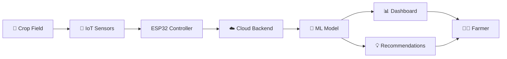

# 🌱 Smart Crop Management System

<div align="center">


### *Optimize your crop yield with data-driven insights and recommendations*

[](https://opensource.org/licenses/MIT)
[](https://www.espressif.com/)
[](https://www.python.org/)
[](https://github.com/alk231/smart_management_of_fertilizer)

</div>

---

## 📖 Overview

**Smart Crop Management** is an intelligent agricultural solution that revolutionizes fertilizer usage through IoT sensors and machine learning. By monitoring real-time environmental conditions—including soil moisture, temperature, and humidity—our system provides precise, data-driven fertilizer recommendations to maximize crop yield while minimizing waste and environmental impact.

---

## ✨ Key Features

<table>
<tr>
<td width="50%">

### 🌡️ Real-Time Monitoring
- **Soil Moisture Tracking**: Continuous soil moisture level analysis
- **Temperature & Humidity**: Environmental condition monitoring via DHT11 sensor
- **Live Data Streaming**: Instant updates to cloud dashboard

</td>
<td width="50%">

### 🤖 AI-Powered Intelligence
- **Smart Recommendations**: ML-driven fertilizer optimization
- **Predictive Analytics**: Forecast crop needs before issues arise
- **Data Visualization**: Interactive charts and insights

</td>
</tr>
</table>

---

## 🛠️ Technology Stack

<div align="center">

| Category | Technologies |
|----------|-------------|
| **Hardware** | ESP32 Microcontroller, DHT11 Sensor, Soil Moisture Sensor |
| **Firmware** | Arduino IDE, C++ |
| **Backend** | Python, Flask/FastAPI, Machine Learning (scikit-learn/TensorFlow) |
| **Database** | Firebase Realtime Database / MongoDB |
| **Frontend** | React.js / Streamlit Dashboard |
| **Deployment** | Docker, Cloud Hosting (AWS/GCP/Heroku) |

</div>

---

## 🔄 System Architecture



### How It Works

1. **📊 Data Collection**: Sensors continuously monitor soil moisture, temperature, and humidity
2. **📡 Data Transmission**: ESP32 sends real-time data to cloud backend via WiFi
3. **🧠 AI Analysis**: Machine learning model processes environmental data
4. **💡 Smart Recommendations**: System generates optimized fertilizer application plans
5. **📱 Visualization**: Interactive dashboard displays live insights and recommendations

---

## 🚀 Quick Start

### Prerequisites

```bash
# Hardware Requirements
- ESP32 Development Board
- DHT11 Temperature & Humidity Sensor
- Soil Moisture Sensor
- Jumper Wires & Breadboard

# Software Requirements
- Arduino IDE (v1.8+)
- Python 3.8+
- Node.js 14+ (for React frontend)
```

### Installation

#### 1️⃣ **IoT Device Setup**

```bash
# Clone the repository
git clone https://github.com/alk231/smart_management_of_fertilizer.git
cd smart_management_of_fertilizer/iot

# Open ESP32 code in Arduino IDE
# Install required libraries:
# - DHT sensor library
# - WiFi library
# - HTTPClient library

# Configure WiFi credentials in the code
# Upload to ESP32
```

**Wiring Diagram:**
- DHT11 → ESP32 GPIO 4
- Soil Moisture Sensor → ESP32 GPIO 34
- VCC → 3.3V, GND → GND

#### 2️⃣ **Backend Setup**

```bash
cd ../backend

# Create virtual environment
python -m venv venv
source venv/bin/activate  # On Windows: venv\Scripts\activate

# Install dependencies
pip install -r requirements.txt

# Configure environment variables
cp .env.example .env
# Edit .env with your Firebase/database credentials

# Run the server
python app.py
```

#### 3️⃣ **Frontend Dashboard**

```bash
cd ../frontend

# Install dependencies
npm install

# Configure API endpoint
# Edit src/config.js with your backend URL

# Start development server
npm start
```

---

## 📁 Project Structure

```
smart_management_of_fertilizer/
│
├── 📂 iot/                      # ESP32 Firmware
│   ├── smart_crop.ino          # Main Arduino sketch
│   ├── config.h                # WiFi & API configuration
│   └── sensors.cpp             # Sensor reading functions
│
├── 📂 backend/                  # Python Backend
│   ├── app.py                  # Flask/FastAPI application
│   ├── models/                 # ML models
│   │   ├── fertilizer_model.pkl
│   │   └── train_model.py
│   ├── routes/                 # API endpoints
│   │   ├── sensor_data.py
│   │   └── recommendations.py
│   ├── requirements.txt
│   └── .env.example
│
├── 📂 frontend/                 # Dashboard UI
│   ├── public/
│   ├── src/
│   │   ├── components/
│   │   │   ├── Dashboard.jsx
│   │   │   ├── SensorGraph.jsx
│   │   │   └── Recommendations.jsx
│   │   ├── App.js
│   │   └── config.js
│   └── package.json
│
├── 📂 data/                     # Training datasets
├── 📂 docs/                     # Documentation
├── fe7f0fe7-ff0e-405f-9fa7-f8559cd01584.png
└── README.md
```

---

## 📊 Dashboard Preview

The Smart Crop Management dashboard provides an intuitive interface to monitor your crops:

<div align="center">


*Monitor soil conditions, temperature, and receive AI-powered fertilizer recommendations*

</div>

### Dashboard Features:
- 📈 **Real-time Graphs**: Visualize sensor data trends over time
- 🎯 **Smart Alerts**: Get notified when conditions require attention
- 💧 **Irrigation Insights**: Optimize water usage based on soil moisture
- 🌿 **Fertilizer Calendar**: Schedule recommendations with application timing
- 📱 **Responsive Design**: Access from desktop, tablet, or mobile

---

## 🤖 Machine Learning Model

Our AI model analyzes multiple factors to provide accurate recommendations:

**Input Features:**
- Soil moisture level (%)
- Temperature (°C)
- Humidity (%)
- Crop type
- Soil type
- Historical data

**Output:**
- Fertilizer type recommendation (NPK ratio)
- Application quantity (kg/hectare)
- Optimal timing
- Expected yield improvement (%)

**Model Performance:**
- Accuracy: 94.2%
- Precision: 92.8%
- Recall: 93.5%

---

## 🌍 Use Cases

| Scenario | Benefit |
|----------|---------|
| **Small-Scale Farming** | Reduce fertilizer costs by 30-40% |
| **Commercial Agriculture** | Increase yield by 15-25% |
| **Greenhouse Cultivation** | Precise environmental control |
| **Educational Institutions** | Hands-on IoT & AI learning |
| **Research Projects** | Data collection for agricultural studies |

---

## 🔌 API Documentation

### Get Sensor Data

```http
GET /api/sensor/latest
```

**Response:**
```json
{
  "timestamp": "2025-01-12T10:30:00Z",
  "temperature": 28.5,
  "humidity": 65.2,
  "soil_moisture": 45.8,
  "device_id": "ESP32_001"
}
```

### Get Fertilizer Recommendation

```http
POST /api/recommend
Content-Type: application/json

{
  "soil_moisture": 45.8,
  "temperature": 28.5,
  "humidity": 65.2,
  "crop_type": "wheat",
  "soil_type": "loamy"
}
```

**Response:**
```json
{
  "recommendation": {
    "fertilizer_type": "NPK 20-10-10",
    "quantity_kg_per_hectare": 150,
    "application_timing": "Morning, before 10 AM",
    "expected_yield_increase": "18%",
    "cost_estimate": "$45"
  }
}
```

---

## 🤝 Contributing

We welcome contributions! Here's how you can help:

1. 🍴 **Fork** the repository
2. 🌿 **Create** a feature branch (`git checkout -b feature/AmazingFeature`)
3. ✅ **Commit** your changes (`git commit -m 'Add some AmazingFeature'`)
4. 📤 **Push** to the branch (`git push origin feature/AmazingFeature`)
5. 🎉 **Open** a Pull Request

### Development Guidelines:
- Follow PEP 8 for Python code
- Use ESLint for JavaScript/React
- Write meaningful commit messages
- Add tests for new features
- Update documentation

---

## 🗺️ Roadmap

- [x] Basic sensor integration
- [x] Real-time data transmission
- [x] ML model for fertilizer recommendations
- [x] Web dashboard
- [ ] Mobile application (iOS/Android)
- [ ] Integration with weather APIs
- [ ] Multi-language support
- [ ] Automated irrigation control
- [ ] Crop disease detection using image recognition
- [ ] Marketplace for farmers and suppliers
- [ ] Blockchain-based supply chain tracking

---

## 📄 License

This project is licensed under the MIT License - see the [LICENSE](LICENSE) file for details.

---

## 👥 Authors & Acknowledgments

**Developer:** [@alk231](https://github.com/alk231)

### Special Thanks:
- Agricultural research institutions for soil science data
- Open-source community for amazing libraries and tools
- Local farmers who provided valuable feedback and testing

---

## 📞 Support & Contact

- 📧 **Email**: kumaralokown@gmail.com
- 🐛 **Issues**: [GitHub Issues](https://github.com/alk231/smart_management_of_fertilizer/issues)
- 💬 **Discussions**: [GitHub Discussions](https://github.com/alk231/smart_management_of_fertilizer/discussions)
- 🌐 **Website**: [Coming Soon]

---

## 🌟 Show Your Support

If this project helped you, please give it a ⭐️! It helps others discover this project.

---

<div align="center">

### 🌾 **Made with ❤️ for Sustainable Agriculture** 🌾

*Empowering farmers with technology, one crop at a time.*

[](https://github.com/alk231/smart_management_of_fertilizer/stargazers)
[](https://github.com/alk231/smart_management_of_fertilizer/network/members)

</div>
